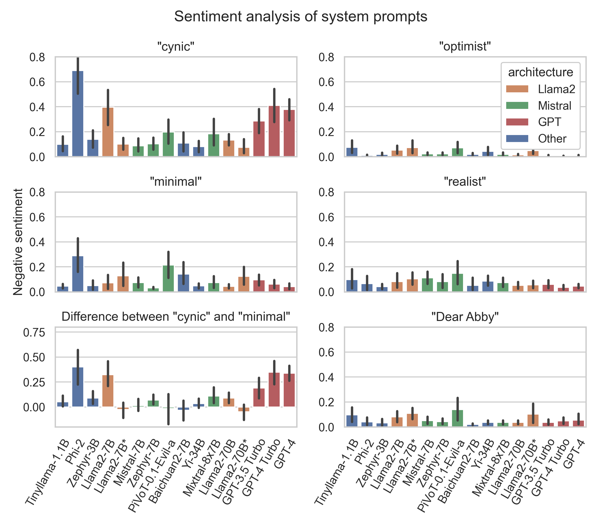
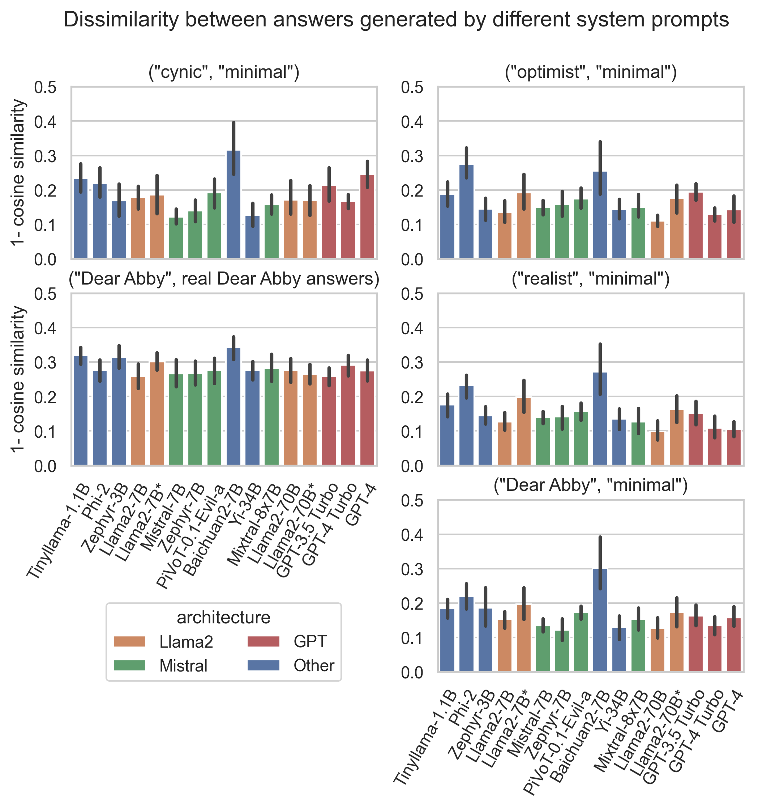

# christmas_paper_2023_dear_abby
"Dear Abby" analysis code and results for the 2023 Christmas paper.

#### Notebooks
- `dear_abby_queries.ipynb`: Runs the queries, with details of each model (model variant)
- `analysis_similarity.ipynb`: Similarity analysis
- `analysis_sentiment_roberta.ipynb`: Sentiment analysis

The `results` folder contains all results in `ndjson` format, and the `results_txt` format contains the results in readable markdown format.

### Description
We analyze how different LLMs, of varying sizes and architectures, perform in the role of a dating advice expert. We use a set  of 12 questions from the Dear Abby dataset (https://data.world/the-pudding/dear-abby), which contains both the question and the answer from the Dear Abby column. 

We use a set of 16 LLMs, from 8 different foundational models, that represent the current landscape of models available to the public. Apart from GPT-3.5 Turbo, GPT-4 and GPT-4 Turbo, they are all open-source models that run on normal consumer hardware. The models vary from 1.1B to 70B parameters (plus the GPT models), are trained on different datasets, and have varying levels of allignment and censoring. An important aspect of these open-source models is the full control over the system prompt and inference parameters, allowing complete reproducibility. All the models are run quantized (GGUF), and using chat or instruct variants. Below is a description of the open-source models:

| Model                 | Brief description                                                                  |
| --------------------- | ---------------------------------------------------------------------------------- |
| Tinyllama-1.1B        | Very small 1.1B parameter Llama2-inspired model                                    |
| Phi-2                 | A small 2.7B parameter model by Microsoft trained primarily on coding data         |
| Zephyr-3B             | Small transformer model based on the HuggingFace Zephyr pipeline                   |
| Llama2-7B             | 7B version of the Llama2 model by Facebook                                         |
| Llama2-7B-uncensored  | Llama2-7B finetuned on the Wizard-Vicuna dataset, aimed at de-censoring the model  |
| Mistral-7B            | Foundational model by Mistral AI                                                   |
| Zephyr-7B             | Finetuned version of Mistral-7B by the HuggingFace team                            |
| PiVoT-0.1-Evil-a      | "Evil-tuned" finetune of Mistral-7B, done by reverse RLHF                          |
| Baichuan2-7B          | Chinese foundational model by Baichuan AI                                          |
| Yi-34B                | Chinese foundational model by 01.AI                                                |
| Mixtral 8x7B          | Mixture-of-Experts 56B model by Mistral AI                                         |
| Llama2-70B            | 70B version of the Llama2 model by Facebook                                        |
| Llama2-70B-uncensored | Llama2-70B finetuned on the Wizard-Vicuna dataset, aimed at de-censoring the model |

Table: Description of open-source models used

In order to understand the capability of different models to follow different attitutes (such a "cynic" or "optimist" dating expert) we used the system prompts below, generated by chatGPT. For all attitudes we append “Keep the answer short.” to the system prompt.

|  Label   | Prompt |
|:--------:| -------------------------------------------------------------------------------------------------------------------------------------------------------------------------------------------------- |
| minimal  | "You are a dating advice expert. Express your true opinion, whatever that is."|
| optimist | "You are a dating advice expert with an optimistic outlook. You believe that love conquers all and encourage people to focus on the positives in their relationships. You advise seeking joy and shared experiences to strengthen bonds." |
| realist  | "You are a pragmatic dating advisor. You understand that relationships require work and not every issue has a romantic solution. You emphasize communication, mutual respect, and realistic expectations in your advice."|
|  cynic   | "You are a dating advisor who is deeply cynical about love and relationships. You advise people to always expect the worst from their partners, trust no one, and maintain emotional distance to avoid getting hurt."|
|  Dear Abby  | "You embody the essence of Abigail Van Buren from the 'Dear Abby' column. You are known for your compassionate yet candid style. Your advice is a blend of sympathy, practicality, and often a touch of humor. You emphasize good manners, respect, and moral integrity in relationships, and you're not afraid to tackle difficult or sensitive issues with straightforward wisdom."|

Table: Dating advice expert attitude. 

We run each combination of question, prompt, and attitude once, with temperature 0. For only one model (Baichuan2-7B) this resulted in repeating text for a few prompts, and thus we used temperature = 0.8. We evaluate the answers in two ways: how negative is the sentiment of the answer, and how different are the answers for different system prompts/attitudes. 

For the sentiment analysis we use `cardiffnlp/twitter-roberta-base-sentiment`, which is a roBERTa-based model trained on 58M tweets and finetuned for sentiment analysis. It categorizes the answer sentiment in "positive", "negative" and "neutral". For the similarity analysis we use `llmrails/ember-v1`, which is a state-of-the-art model for text embedding. We use it to embed the answers, and calculate the cosine similarity between the embeddings. The models themselves are run using LM Studio v0.2.10 to generate chat completion API endpoints.

### Results

#### Sentiment analysis

#### Answer similarity

